# 🏗️ Kiến trúc Claude Code — AI Agent Architecture

> **Claude Code** là một hệ thống AI Agent phức tạp được thiết kế để tự động hóa các tác vụ lập trình.  
> Hệ thống vận hành dựa trên vòng lặp **Perception → Action → Observation** và được module hóa thành 6 layer rõ ràng.
>
> *Claude Code is a complex AI Agent system designed to automate programming tasks.*  
> *The system operates on a **Perception → Action → Observation** loop and is modularized into 6 distinct layers.*

---

## Tổng quan Kiến trúc · *Architecture Overview*

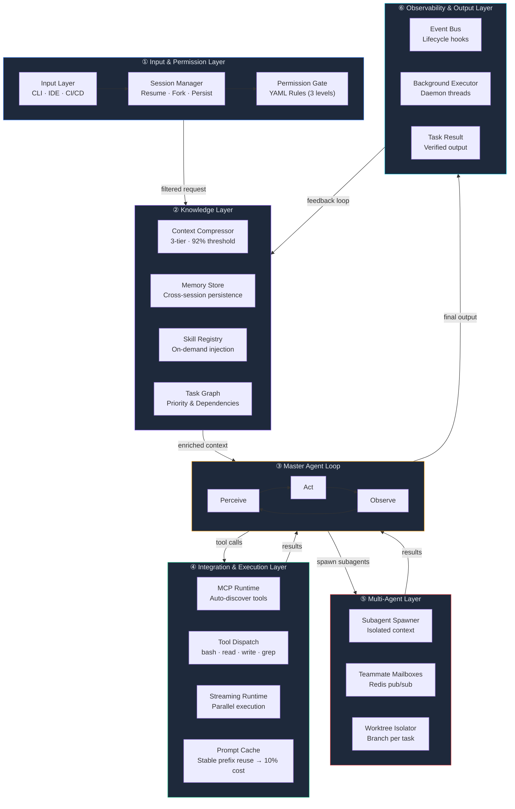

---

## ① Lớp Đầu vào & Kiểm soát · *Input & Permission Layer*

### Input Layer

Tiếp nhận yêu cầu từ nhiều nguồn:  
*Accepts requests from multiple sources:*

| Nguồn · *Source* | Mô tả · *Description* | Ví dụ · *Example* |
|-------|--------|-------|
| **CLI** | Giao diện dòng lệnh · *Command line interface* | `claude "fix bug #42"` |
| **IDE** | Tích hợp VSCode, JetBrains · *VSCode, JetBrains integration* | Claude panel trong editor · *Claude panel in editor* |
| **CI/CD** | Pipeline tự động · *Automated pipeline* | GitHub Actions trigger |

### Session Manager

Quản lý trạng thái phiên làm việc với 3 chế độ:  
*Manages session state with 3 modes:*

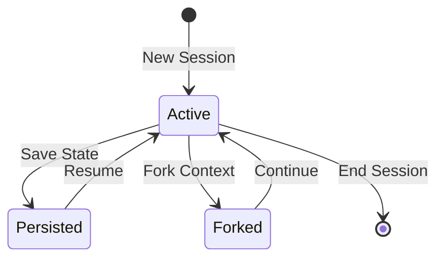

- **Resume** — Tiếp tục phiên trước đó với đầy đủ ngữ cảnh · *Continue previous session with full context*
- **Fork** — Rẽ nhánh từ một điểm trong phiên để thử hướng khác · *Branch from a session point to try a different approach*
- **Persist** — Lưu trữ trạng thái để sử dụng sau · *Save state for later use*

### Permission Gate

Chốt chặn an ninh sử dụng **YAML rules 3 cấp độ**:  
*Security checkpoint using **3-level YAML rules**:*

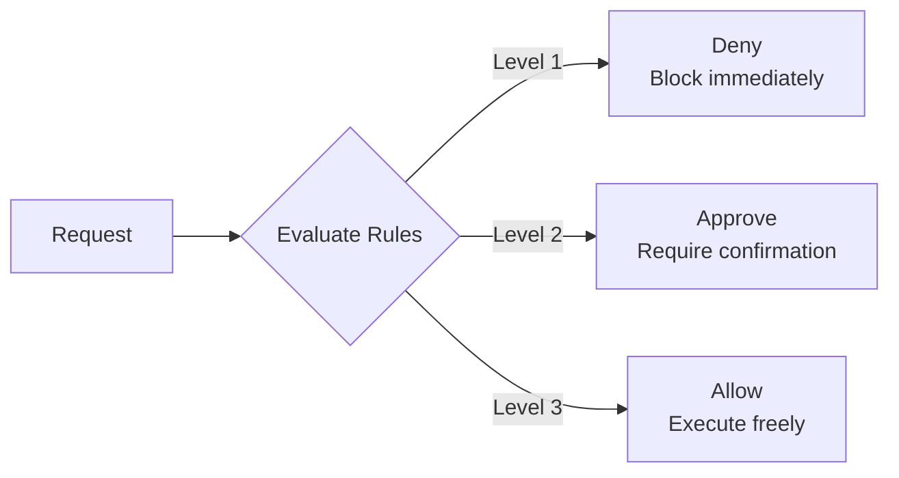

```yaml
# .claude/settings.json — Permission rules
permissions:
  deny:
    - "rm -rf /"
    - "DROP TABLE"
  approve:
    - "npm publish"
    - "git push --force"
  allow:
    - "git status"
    - "npm test"
```

> **Nguyên tắc:** Permission Gate "quan sát mọi thứ" trước khi cho phép vào vòng lặp chính.  
> ***Principle:** The Permission Gate "observes everything" before allowing entry into the main loop.*

---

## ② Lớp Kiến thức · *Knowledge Layer*

Bộ não cung cấp dữ liệu cho Agent, tối ưu cho việc xử lý ngữ cảnh lớn.  
*The brain that supplies data to the Agent, optimized for handling large contexts.*

### Context Compressor

Cơ chế nén ngữ cảnh **3 lớp** với ngưỡng kích hoạt **92%**:  
*3-layer context compression mechanism with **92%** activation threshold:*

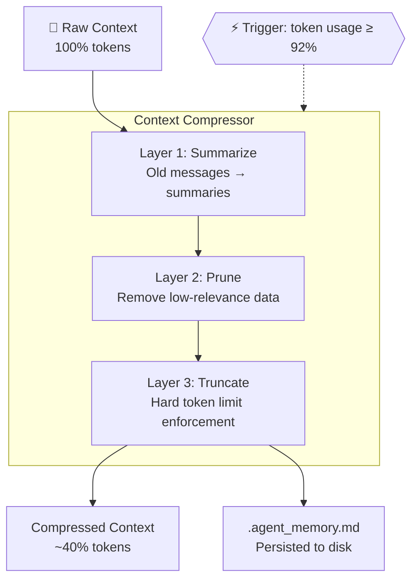

### Memory Store & Skill Registry

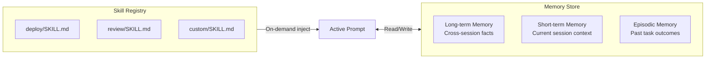

- **Memory Store** — Lưu trữ xuyên suốt phiên, ghi vào `CLAUDE.md` và `.agent_memory.md` · *Cross-session storage, persisted to `CLAUDE.md` and `.agent_memory.md`*
- **Skill Registry** — Tiêm (inject) kỹ năng vào prompt khi phát hiện context phù hợp · *Injects skills into prompts when matching context is detected*

### Task Graph

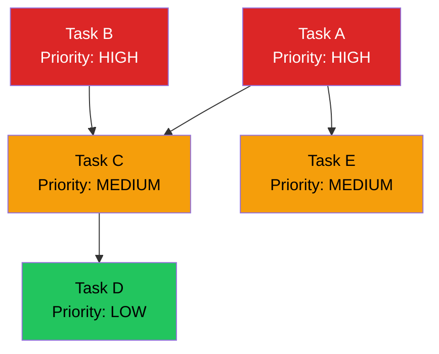

> Sắp xếp thứ tự thực thi dựa trên **priority** và **dependency graph** — đảm bảo không task nào chạy trước khi dependencies hoàn tất.  
> *Execution order is based on **priority** and **dependency graph** — ensuring no task runs before its dependencies are completed.*

---

## ③ Vòng lặp Trung tâm · *Master Agent Loop*

Đây là **trái tim** của hệ thống — vòng lặp liên tục **Perceive → Act → Observe**:  
*This is the **heart** of the system — a continuous **Perceive → Act → Observe** loop:*

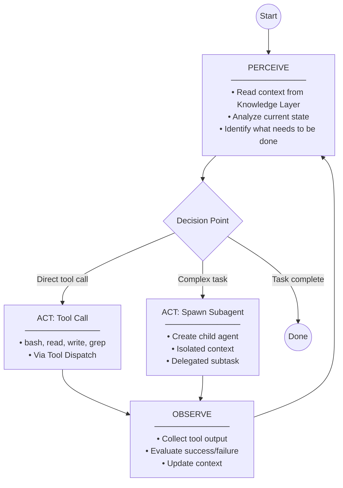

### Đặc điểm chính · *Key Characteristics*

| Đặc điểm · *Feature* | Mô tả · *Description* |
|-----------|--------|
| **Self-correcting** | Tự phát hiện lỗi và thử lại với cách tiếp cận khác · *Auto-detects errors and retries with a different approach* |
| **Context-aware** | Luôn cập nhật ngữ cảnh mới nhất từ Knowledge Layer · *Always updated with the latest context from the Knowledge Layer* |
| **Goal-driven** | Theo dõi mục tiêu cuối cùng, không lạc hướng · *Tracks the final goal, stays on course* |
| **Tool-agnostic** | Có thể gọi bất kỳ tool nào đã đăng ký · *Can invoke any registered tool* |

---

## ④ Lớp Tích hợp & Thực thi · *Integration & Execution Layer*

### MCP Runtime (Model Context Protocol)

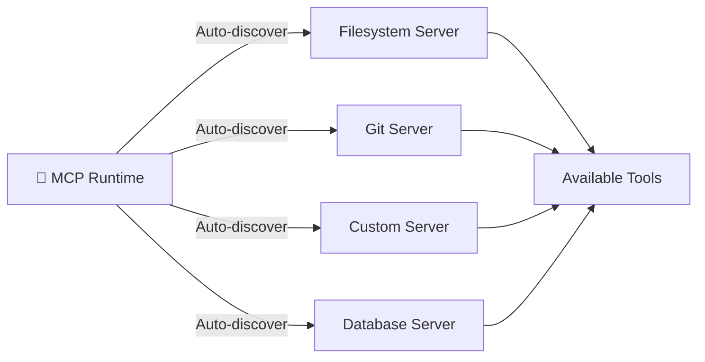

Cấu hình trong `.mcp.json`: · *Configuration in `.mcp.json`:*
```json
{
  "mcpServers": {
    "github": { "command": "npx", "args": ["-y", "@modelcontextprotocol/server-github"] },
    "filesystem": { "command": "npx", "args": ["-y", "@modelcontextprotocol/server-filesystem", "./"] }
  }
}
```

### Tool Dispatch

Mỗi công cụ có handler riêng biệt:  
*Each tool has a dedicated handler:*

| Tool | Handler | Mô tả · *Description* |
|------|---------|--------|
| `bash` | `BashHandler` | Thực thi shell commands · *Execute shell commands* |
| `read` | `FileReadHandler` | Đọc nội dung file · *Read file contents* |
| `write` | `FileWriteHandler` | Ghi/tạo file · *Write/create files* |
| `grep` | `SearchHandler` | Tìm kiếm trong codebase · *Search the codebase* |
| `edit` | `EditHandler` | Chỉnh sửa file có sẵn · *Edit existing files* |

### Streaming Runtime & Prompt Cache

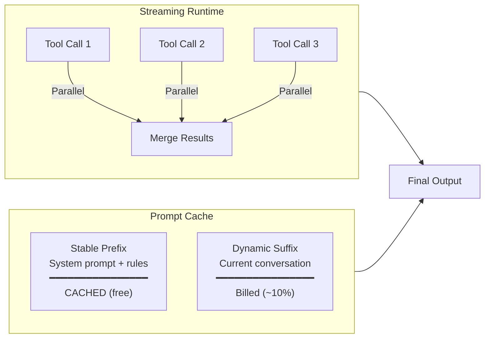

> **Prompt Cache** giúp giảm chi phí xuống **~10%** bằng cách tái sử dụng stable prefix (system prompt, rules, skills) — chỉ phần dynamic suffix mới tốn token.  
> ***Prompt Cache** reduces cost to **~10%** by reusing the stable prefix (system prompt, rules, skills) — only the dynamic suffix consumes tokens.*

---

## ⑤ Lớp Đa Tác tử · *Multi-Agent Layer*

Khi tác vụ phức tạp cần chia nhỏ:  
*When complex tasks need to be divided:*

### Subagent Spawner & Communication · *Giao tiếp giữa các Agent*

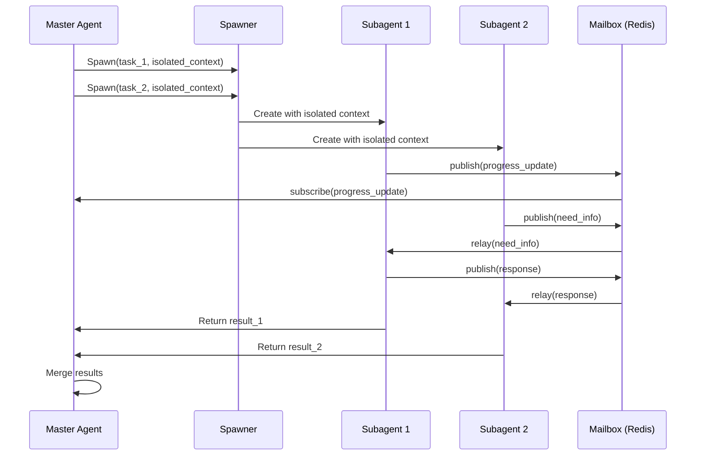

### FSM Protocol — Quản lý trạng thái giao tiếp · *Communication State Management*

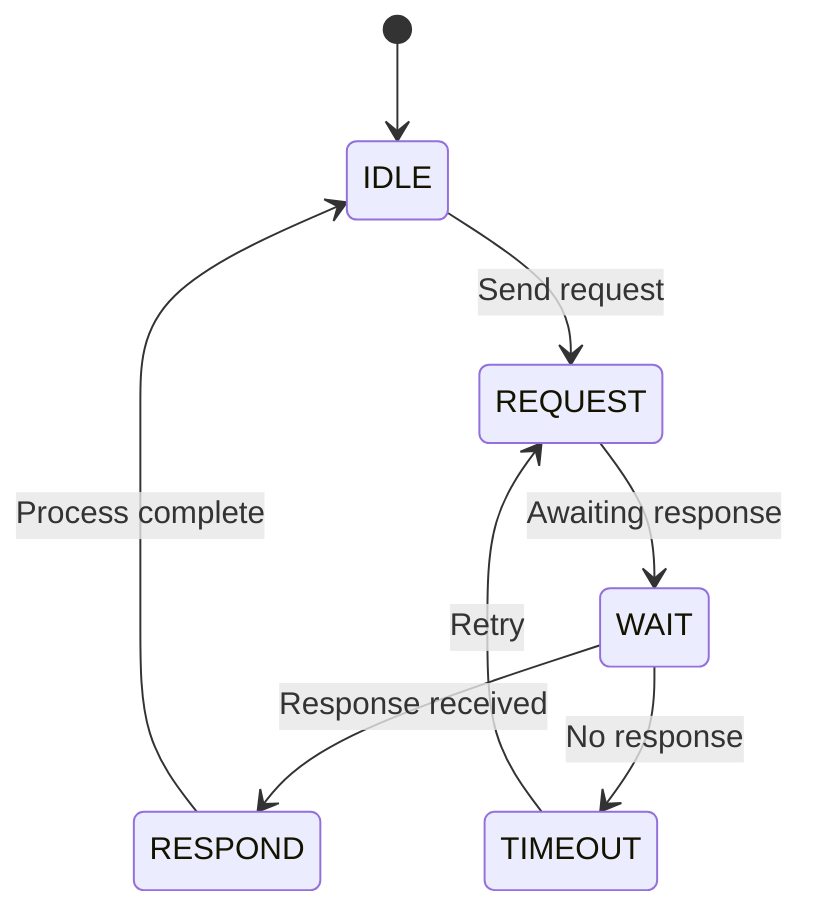

### Worktree Isolator

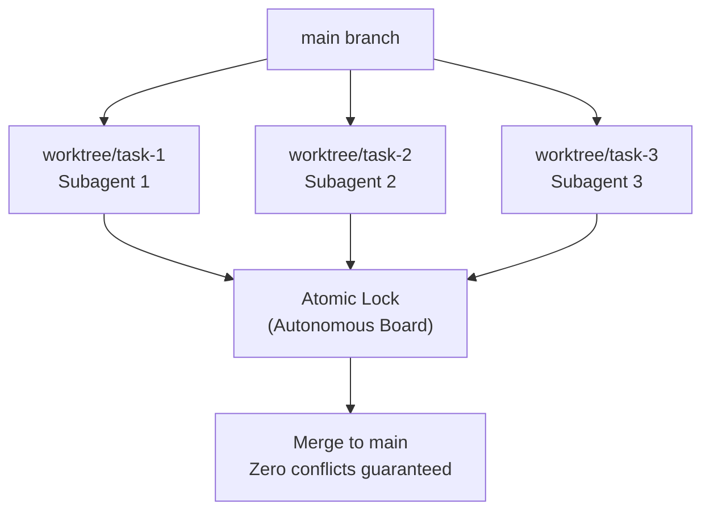

> Mỗi subagent làm việc trên **branch riêng** → không xung đột code. **Atomic lock** đảm bảo merge tuần tự, an toàn.  
> *Each subagent works on a **separate branch** → no code conflicts. **Atomic lock** ensures sequential, safe merges.*

---

## ⑥ Lớp Giám sát & Đầu ra · *Observability & Output Layer*

### Event Bus & Background Executor

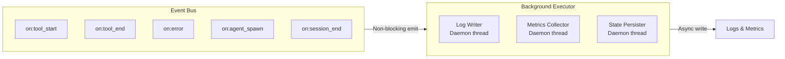

### Output & Feedback Loop

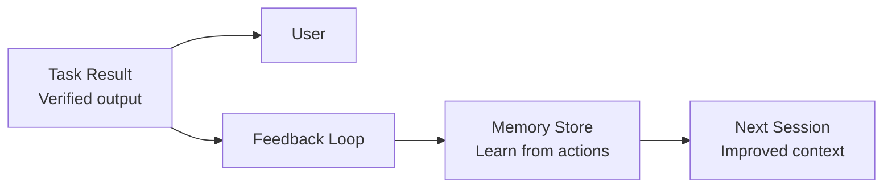

> Kết quả được **xác minh** trước khi trả về. Đồng thời tự động cập nhật vào Memory Store để hệ thống **"học"** từ các thao tác vừa thực hiện.  
> *Results are **verified** before being returned. Simultaneously, the Memory Store is auto-updated so the system **"learns"** from performed actions.*

---

## Mapping: Kiến trúc ↔ Cấu trúc Project · *Architecture ↔ Project Structure*

| Layer | File/Directory trong scaffold · *Files/Directories in scaffold* |
|-------|-------------------------------|
| **Input & Permission** | `.claude/settings.json` — permissions, hooks |
| **Knowledge Layer** | `CLAUDE.md`, `.claude/rules/*.md`, `.claude/skills/` |
| **Master Agent Loop** | Claude Code runtime (built-in) |
| **Integration & Execution** | `.mcp.json`, `.claude/hooks/` |
| **Multi-Agent Layer** | `.claude/agents/*.md` |
| **Observability & Output** | `.claude/hooks/`, Event-driven scripts |

---

## Tóm tắt Luồng Hoạt động End-to-End · *End-to-End Workflow Summary*

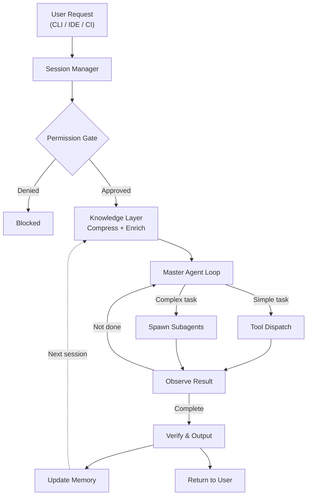

---

> **Tài liệu này** mô tả kiến trúc conceptual của Claude Code dựa trên phân tích hệ thống.  
> *This document describes the conceptual architecture of Claude Code based on system analysis.*  
> Xem thêm · *See also*: [Generated Structure](../README.md#generated-structure) · [Template Files](../template/)
